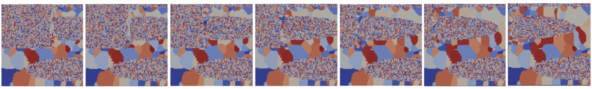

# Video Forecasting model (Conv-LSTM) to accelerate the prediction of material microstructure Evolution

<p float="left" align="center"> 

</p>

## Intro
The focus of this project is the development of cost-effective and adaptable software strategies to promote Virtual Testing for the Process-Structure-Property (PSP) modeling. 

We investigate the use of deep neural networks for the prediction of microstructure evolution in engineering materials. This investigation enables incremental materials technology improvements, by accelerating the traditional CFD workloads and establishing process-structure linkage.

The project is conducted in collaboration with the Materials and Processes Section TEC-MSP at the ESA's Mechanical Engineering Department at ESTEC, Noordwijk, The Netherlands, within the research group of Integrated Computational Materials Engineering for space relevant Additive Manufacturing processes.

## Requirements
- Python > 3.0
- Pytorch 1.0

## Install 
pip3 install -r requirements.txt

## Dataset 
Our dataset consists of 2D time series datasets (image time series). Labels are automatically generated according to statistical sampling (Dakota). Data quality defined by resolution of numerical datasets (correlated to computation time). The time series images are organized in folders, based on different simulation settings and every folder is listed in a `.txt` config file. 
The data are produced and owned by ESA TEC-MSP.

### Dataloader
A data sample (a video) is created based on the temporal sequence of images by a custom dataloader. To enumerate all video samples in the dataset, a new `.txt` config file is manually created that contains a row for each video clip sample in the dataset. Note that the training, validation, and testing datasets have separate config files. Each row is in the format `VIDEO_PATH START_FRAME END_FRAME`. 

A complete tutorial on how to create a video dataloader with pytorch can be found here: [[video dataset loading]](https://github.com/RaivoKoot/Video-Dataset-Loading-Pytorch)

## Model 
The model is a conv-lstm network, which is implemented in PyTorch by NVidia Labs, based on the paper, '***Convolutional Tensor-Train LSTM for Spatio-Temporal Learning***', NeurIPS 2020. [[project page](https://sites.google.com/nvidia.com/conv-tt-lstm)] [[original repo](https://github.com/NVlabs/conv-tt-lstm)]

## Loading the dataset and training the model
1) create a custom config file for training and testing with ``config_videocreator.py``
2) Load the videos with ``ms_dataloader.py``
3) Train the model with ``ms_model_train.py``

## Training the model with HPC cluster
In order to submit an already created job script, the command ``sbatch`` has to be used.
```
sbatch train_ms.sh
```

## Testing the model
* In order to run the test code, you must have trained the model and saved at least one checkpoint as a '.pt'  file


#### License 
The conv-tt-lstm model is under Copyright (c) 2020 NVIDIA Corporation. All rights reserved. This work is licensed under a NVIDIA Open Source Non-commercial license.


## Contacts
The project for the microstructure prediction is written by [Monica Rotulo](https://github.com/Mooon) \(monica.rotulo@surf.nl\)
